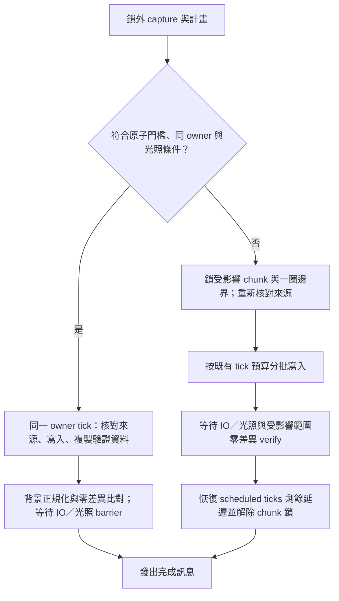

# 常用操作效能與 chunk 套用隔離（2026-10-08～09）

目標是在一般建築變動（數十至數百 chunk）下，從送出指令到完成訊息盡量不超過 2 秒。這是量測目標；冷啟動、世界生成、初次 init、千 chunk 寫入、光照與磁碟屏障另列實際耗時，不把預檢完成當成操作完成。

## 可重現方法

所有 runner 自行取得 `.work/bench.lock`，不能再外包 flock。一次只執行一個 runner。Gradle 使用 `.work/gradle-home`、`--configure-on-demand --max-workers=1`；benchmark 不增加寫世界預算，仍遵守 #30／#72。結果寫到 `.work/perf/<label>/result.json`，每條命令的輸出與時間保存為 `commands.jsonl`。保留證據後刪除世界副本；不改 baseline 或 `experiments/`。

CLI 每筆是新的 Java 21 JVM，`-Xmx1G`，包含啟動與 CLI 解析。`PerformanceFixture.java` 建立 1,296／20,000 chunk，每 chunk 一個實心 section；每個變動 chunk 只改一格。這個 fixture 用來區分世界總量與變動量，不能替代有 block entity、複雜 palette、實體及多 section 的生存世界。另以既有 1.21.11 baseline 複本重現原始慢切換。

```sh
python3 tools/performance/benchmark.py --label before-matrix --jar .work/perf/before-wgit.jar
python3 tools/performance/benchmark.py --label after-matrix
python3 tools/performance/noop.py --label after-real
python3 tools/performance/noop.py --label before-real --jar .work/perf/before-wgit.jar --rounds 1
python3 paper/tools/benchmark.py --latency paper 1.21.11 --label before --artifact .work/perf/before-paper.jar
python3 paper/tools/benchmark.py --latency paper 1.21.11 --label after --require-isolation
python3 paper/tools/benchmark.py --latency folia 1.21.11 --label after --require-isolation
python3 fabric/tools/benchmark.py 1.21.11 --label after --require-isolation
python3 tools/performance/single.py 1.21.11 --label after --artifact fabric/mc1_21_11/build/libs/worldgit-fabric-1.21.11-0.1.0-SNAPSHOT.jar --require-isolation
```

runner 及自動比較表的操作說明見 [tools/performance](../tools/performance/README.md)。預設三輪，switch 每輪往返兩次；列 p50／max，不扣除 GC、存檔或光照。舊 jar 沒有新版 chunk probe API，使用 `--artifact <before.jar> --legacy-baseline --rounds 1` 執行同一 fixture 的端到端與 TPS 基準；`--latency-only` 保留為參數別名。相容探針讀取舊版編輯鎖，保留舊版全伺服器暫停造成的 TPS 數據，但不執行新版 chunk 隔離／對抗驗收，不能與 `--require-isolation` 同用。現行 jar 的隔離與對抗斷言仍全部執行，舊基準一筆樣本的 p50／max 相同。Paper／Folia／Fabric dedicated 取送出 console 指令至終態行的時間（10 ms 輪詢解析度），Fabric 單人取同一 JVM 客戶端送出與收到聊天完成訊息的 nanoTime。單人以正式 jar 執行，不用 development classpath 掩蓋 jar 相容問題；正式比較的前後 runner 都將 llvmpipe 限為 20 FPS，避免 3 核環境的軟體渲染競爭。驗收客戶端使用 `inactivityFpsLimit=MINIMIZED`：原版十分鐘 AFK 的 10 FPS 限制會經 Fabric GameTest 的同步 phaser 將整合伺服器一起限為 10 TPS；自動送指令不會重設原版鍵鼠輸入時間。前後比較均關閉 AFK 降速，正式模組不修改此玩家設定。存檔候選修正前的中間量測使用 60 FPS，獨立保留，不能與 20 FPS 的最終結果混算倍率。新版 dedicated fixture 有 2,704 個預先生成的 chunk，變動使用中央 32×32 範圍；邊界緩衝避免 ticking ticket 引起正常地形生成。歷史線上基準的 1,296 chunk fixture 尺寸不同，數字分開列出，不能據此宣稱同 fixture 的倍率。線上基準無玩家、單人有一位玩家；安全預算分別由既有無玩家／有玩家規則決定。

## Profile 與優化

原始 switch JFR 的 1,458 個 sample 約 43% 落在 `BlockState.air()`：逐格建立 `Set.of`。切換的預檢與驗證原本都完整 capture；相同 HEAD 的分支仍重讀整個世界。原始 1,296 chunk 世界在此環境、Java 21、`-Xmx1G` 的重新量測：init 15.565 秒，status 0.933 秒，no-op commit 0.889 秒，switch 29.398／29.515 秒。主對話的 switch 21.9／22.0 秒使用不同啟動設定；不混成同一組改善倍率。

另以整個 section 變動的 merge 做 40 秒 JFR，發現交界六鄰居檢查反覆尋找相同 Git tree／blob 路徑；物件 ID 每次用正規表示式驗證。主要修正如下：

- `BlockState.air()` 直接比較三種名稱，避免逐格集合配置。
- 索引命中後的 20,000 chunk status JFR 仍有 269 samples，多數在不可變 Set／Map 的線性探測。`ChunkPos` 的 record 預設 hash 為 `31*x+z`，方形世界形成密集 cluster；改為混合完整 64-bit 座標，避免 `Set.copyOf`／`Map.copyOf` 退化。equals、排序、Git 路徑與編碼不變。這是「candidates=0、payloads-read=0 仍需約 3.4 秒」的額外瓶頸。
- section 編碼先記錄 palette 與 index，以 identity 快取省去重複 state／properties hash；仍以值相等維持 palette 首次出現順序與原始編碼 bytes。均勻 palette 共用 state，空氣 section 不建立 4,096 格物件；仍檢查 packed data 與保留 biome／BE 語意。
- JGit store 最多快取 128 棵、每棵最多 4,096 entries 的不可變 tree；merge 最多快取 256 個 tree/path 查詢（含不存在）。tree 命中仍消耗原來的 decode budget；啟用聚合 scope 時 merge 路徑查詢保留原本逐 tree 的計費路徑。SHA-1 字串以 40 個 ASCII 十六進位字元檢查，不重複編譯 regex。
- switch／restore／reset／stash 的 working capture 沿用 status 索引；switch 的 dirty 檢查沿用預檢剛擷取的樹。寫入後強制重新擷取實際寫入與實體來源／目的 chunk，再掃其餘 chunk 的保守候選。完成後只重新綁定索引 HEAD。工作樹、目前 HEAD 與目標樹完全相同時只以 CAS 移動 HEAD，不呼叫 writer／flush／chunk 鎖；一般無差異計畫也跳過線上 apply／flush 與 chunk 鎖。
- player-touched 的 UUID 存活普查改讀其餘原始 entity NBT，避免非空 touched 集合迫使每次完整正規化地形；含實體與上一輪實體所在 chunk 仍列為候選，移動／消失不漏掉。
- Paper 的 copy 鏈直接延遲到下一個 chunk 的 owner，去掉「等待一 tick 再排另一個 region task」的兩次排程；每鏈每 tick 仍最多一份，8 份上限不變。
- dirty tracker 分成待 capture 與待 commit 兩份 generation；只有成功持久化索引才推進 capture 游標，status 不會清掉自動 commit 的觸發。capture 後的新事件以 generation 比對保留，失敗不推進。卸載轉換重新核對磁碟；unsaved 普查仍保守列候選。
- Fabric 以 16 個在途快照、最多 32 份原始複本的 LRU、2 個背景正規化執行緒重疊 owner 複製與 CPU 工作；owner 原始複製每 tick 最多 8 個／5 ms 軟預算。Git 物件寫入仍序列化，沒有在 owner 執行緒等待背景 future。
- Fabric 原本的全量存檔在 owner 同步等待 terrain／entity IO；千 chunk 量測雖平均約 20 TPS，最長 tick 間隔仍超過 1.5 秒。改由 `ChunkSaveQueue` 在 owner 每 tick 最多處理 8 個 chunk／5 ms 軟預算，排入 vanilla terrain、entity、POI 儲存器；repository 執行緒等待三者的同步 future。metadata 仍包含世界設定及 dirty saved-data，不省略持久化屏障。停止伺服器時由既有任務泵完成剩餘工作，不依賴已停止的下一個 tick。

- 單人 benchmark 的 1,296 loaded chunk 另暴露存檔佇列的固定成本：status 約 0.2 秒，no-op commit／switch 仍約 8.7 秒，因為乾淨 terrain 與已知空的 entity chunk 也每 tick 只排 8 job。全量 flush 改先普查 unsaved terrain、POI dirty chunk 與原版 entity save 集合，只略過原版已載入、storage 確認為空且目前沒有 saveable entity 的 chunk；最後一個實體離開時仍寫回空狀態。指定範圍及 IO barrier 不變，新增停服前讀取磁碟的實體生成／最後移除回歸。最終量測見下方單人與 dedicated 表。

## 增量正確性與失效

索引是可丟棄的本機快取，沒有變更 Git 物件格式。它綁 HEAD、ignore／repo 設定、實體模式、容許距離、正規化 fingerprint 及 touched 集合。新索引版本用 SHA-256 校驗完整 body；損毀、截斷、舊版本、無效 tree 或政策變動，回退完整擷取。

離線 scan 每次仍讀 region header。除了 mtime／size／fileKey、chunk 時間戳與 sector location，region 與外部 `.mcc` 加入 Unix ctime；外部工具還原 mtime／同秒時間戳也不能沿用舊內容。provider 不支援 ctime 時保守重讀 compressed payload SHA-256。同秒不確定窗沿用原有規則。受影響 chunk 必須重新 capture，未受影響 chunk 必須經這份重新 scan 的內容證明才沿用，離線驗證因此仍比較整棵 working tree。線上的自然模擬與驗證範圍另見下節。新增測試讓 writer 修改計畫以外 chunk，必須留下 PARTIAL、原 HEAD 且驗證失敗。

線上每次仍在 owner 普查已載入 chunk 的 unsaved 旗標與實體位置，並聯集事件 dirty generation；成本為 O(loaded chunks + live entities)，不逐格正規化。unsaved 在存檔前持續為真時會持續列候選，沒有以 acknowledge 清除原版旗標。這是保守正確性的成本，不能宣稱所有活世界的 no-op 永遠 O(變動量)。

CLI 隱藏的全域 `--full` 可用於 `status`、`commit`、`switch` 等完整 capture 比對；線上 `status --full` 保留。明確 `verify HEAD` 強制完整擷取，供驗收獨立於增量路徑核對。

## 使用者決定：不凍結，不使用 agent（2026-10-08）

本次由使用者明確決定，取代 #39、#148 及 #149 中的 tick 暫停方案。Paper／Folia 插件不啟動外部 JVM、不 attach、不 instrumentation，也不改寫 bytecode。`paper/tick-agent` 及 agent manifest、載入流程、相關測試全部移除。Fabric 不覆寫世界的 TickRateManager，也不改全伺服器 frozen／step 狀態；單人與 dedicated 共用這份模型。

小變動先在 owner 核對光照遮蔽、發光量與形狀條件；只有不需跨 tick 改變光照的內容才走原子路徑，其餘即使只有一個 chunk 也使用 chunk 鎖。原子路徑在真正 owner 的單一 tick 中最後核對來源內容，直接寫 section／BE／biome／scheduled ticks／實體，更新 heightmap／POI 並立即擷取不可變驗證資料。寫入和這份資料的擷取之間沒有遊戲 tick。正規化、Git 比對與 IO／光照 barrier 在背景完成；完成訊息仍等待 barrier 與零差異比對。資料擷取後世界照常運作，流水開始流動屬於正常行為。驗證 receipt 的時間早於後續存檔，因此索引不為 receipt chunk 綁定後續磁碟 stamp，也不清掉其後收集到的 dirty generation；下次 status 必須重新擷取，不能把正常模擬藏進快取。原子路徑目前保守預設為 **1 chunk、1 section、8 個實體操作**，只接受全部已載入且 entity IO 已完成的 chunk；Paper 只在單一主 owner 使用。設定是 `apply.atomic-max-chunks`／`atomic-max-sections`／`atomic-max-entities`，大小值設為 0 可停用，範圍上限分別為 8／8／32。Folia 目前一律使用下述 chunk 鎖，因為排程路徑尚未提供同 owner 的原子套用證明；不承諾跨 region 同 tick 交易。

大變動只鎖計畫的 chunk、實體來源／目的地及一圈 chunk 邊界。Paper／Folia 在各 owner 從 LevelTicks 取出排程容器，保留於 chunk 中但不再排入 vanilla 模擬；從原生 ticking chunk、random candidate、BE ticker、非玩家 entity ticker 與 piston block-event 集合暫時取出受鎖內容。新 section／BE／實體在返回遊戲迴圈前加入同一鎖。實體 chunk 的原生狀態降為不 ticking。對目標世界已載入與新加入的實體，在其 owner 暫時裝上可還原的 NMS `EntityInLevelCallback` 包裝物件；跨入／跨出受鎖範圍時，在原生 EntityLookup 更新位置索引前還原位置，包含非 living entity 與高速移動。這只更換資料回呼，不改 class／bytecode；解除後在各實體的當前 owner 還原。玩家與 living entity 的移動另由事件取消。已載入 chunk 以 FULL loading ticket 保留，不新增 ticking 半徑；後續載入的受鎖 chunk 由載入事件及 apply owner 再確認，未載入內容仍只由 owner 寫入，不直接改 .mca。Folia 使用 `RegionizedWorldData` 的集合，不能呼叫其刻意未實作的 world 級 ticking getter。來源見 [Folia region threading patch](https://github.com/PaperMC/Folia/blob/ver/1.21.11/folia-server/minecraft-patches/features/0001-Region-Threading-Base.patch)。

Fabric 在 chunk／entity／BE 的 vanilla tick 入口按座標略過，只對受鎖範圍的 LevelTicks 條件加上遮罩。方塊寫入、活塞整段作用範圍、爆炸可能影響的範圍、作物、玩家互動、實體移動及傳送另有位置屏障。底層 `Entity.setPosRaw` 也檢查已登記實體的來源／目的 chunk，涵蓋箭矢等繞過 `Entity.move` 的原生路徑；未登記實體的建構／載入定位與 WorldGit owner 內部寫入保留。對抗驗收同時檢查直接 `setPos`／`setPosRaw` 被拒，以及外部箭矢繼續 tick 但不能進入邊界。世界時間及其他 chunk 照常前進。

暫緩的 scheduled ticks 留在原容器，不消耗、不丟失 priority／subTickOrder。capture 使用受鎖 chunk 的模擬時間基準；若計畫替換 ticks，基準改為替換當下。受鎖 chunk 存檔前也會重設排程時間基準，避免序列化負的剩餘延遲。解除時延後 triggerTick，保留剩餘延遲，重新綁定容器排程。替換 ticks 會先清除原排程，以目標 ticks 為準；舊 piston event 只在目標仍有同一 block type 時恢復。邊界緩衝的原排程保留。Paper 的事件屏障取消流體／鄰居更新時記錄座標，解除後在相應 owner 重新排入更新，避免邊界更新永久遺失。

capture 與計畫在鎖外；chunk 鎖取得後重新比對受影響部分，原子路徑更在實際寫入的同一 owner tick 以內容比對最後核對。dirty generation 與 unsaved 候選保留；外部變動回報重試，不能只憑清除 dirty 旗標推定安全。大變動保留鎖直到光照、IO 與驗證完成。自然模擬可能使未受影響的 chunk 產生新的 working changes，因此線上驗證以受影響 chunk 的零差異及 writer 有界範圍為準，遠處變動留為 dirty；離線仍比較整棵樹，原有「writer 偷改範圍外」回歸保持。明確 `verify HEAD` 仍是完整擷取，正常模擬後可呈現新的世界變動。

多世界與同世界 probe 在 A 的具體受鎖 chunk 觀察鎖狀態；A 的時間必須前進，B 的時間／流水／紅石必須前進，A 世界遠處 chunk 的時間／流水／紅石也必須前進。遠處探針區域明確放入 fixture 的 area ignore，避免探針的持續自然變動被當成使用者待提交的建築。不能以 TPS 單一訊號取代流水及紅石斷言。Fabric 探針使用有底與邊牆、固定淨空的水槽，排除天然地形選擇流向造成的假陰性；每次受鎖窗口開始後清空水槽並放入新水源，觀察鄰格實際產生流水。長窗口要求每筆 B TPS 至少 18（預期約 20），流水／紅石與遠處模擬仍須逐筆全部前進。



## 邊界與已知限制

收尾修正了 Fabric 跨維度 UUID 預檢：傳送至尚未載入 entity chunk 的實體可能不在 `getEntity`／`getAllEntities` 可見集合，但 UUID 已登記在 entity manager。預檢現在也查核 manager 的 known UUID，並保留未載入 entity region 的磁碟檢查；第一筆寫入前拒絕重複且指出維度。完整 dedicated Phase 5 的原斷言已通過，沒有改成套用後才拒絕。

Folia 各 region 的鎖分別取得與釋放，沒有跨 region 原子提交；來源再核對與最終 verify 會拒絕取得期間的競爭。第三方任意 NMS 寫入必須配合公開 `isChunkEditLocked(world,x,z)`；沒有通用 Bukkit 攔截器。跨世界／任意座標指令及 Axiom 無座標批量入口仍採保守指令屏障。共享 CPU、GC、光照與 IO queue 仍可能延長其他 chunk 的 tick 間隔。#146 的 26.2 world clocks／metadata 邊界仍適用。

## 量測結果與驗收

以下是最終 jar 的完成訊息時間，每格為 **p50 / max 秒**。CLI 主矩陣及補充矩陣前後各三輪；線上與原始世界前測一輪、後測三輪，switch 每輪往返兩次。init 與最後的完整 verify 各一筆；單樣本的 p50 與 max 相同，不代表穩定性已獨立證明。短命令 TPS 有首尾 tick 取樣誤差，隔離與穩態 TPS 使用千 chunk 切換長窗口。完整 JSON 與驗證摘要保存在 [performance](performance/validation.json)，artifact 與 log SHA-256 可核對實際版本。

### CLI：1,296／20,000 chunk

[優化前 JSON](performance/before-cli.json) · [優化後 JSON](performance/after-cli.json)

1296 chunk · synthetic-one-solid-section-per-chunk

| 操作 | 優化前 p50 / max（秒） | 優化後 p50 / max（秒） |
|---|---:|---:|
| `init` | 3.349 / 3.349 | 2.528 / 2.528 |
| `status-noop` | 2.385 / 2.529 | 0.941 / 0.954 |
| `commit-noop` | 0.859 / 0.885 | 0.949 / 1.253 |
| `switch-noop` | 3.786 / 3.967 | 0.988 / 1.034 |
| `commit-1` | 1.222 / 2.543 | 1.047 / 1.271 |
| `commit-10` | 1.263 / 2.241 | 1.146 / 1.161 |
| `commit-100` | 1.716 / 2.608 | 1.412 / 1.486 |
| `commit-1000` | 3.120 / 3.243 | 2.743 / 2.787 |
| `switch-1` | 3.919 / 4.014 | 1.222 / 1.403 |
| `switch-10` | 3.939 / 4.260 | 1.315 / 1.360 |
| `switch-100` | 4.318 / 4.475 | 1.736 / 1.795 |
| `switch-1000` | 6.392 / 6.780 | 4.285 / 4.823 |
| `merge-1` | 5.584 / 6.218 | 1.386 / 1.414 |
| `merge-10` | 6.535 / 6.574 | 1.517 / 1.552 |
| `merge-100` | 16.353 / 16.699 | 2.287 / 2.470 |
| `verify-full` | 2.462 / 2.462 | 1.492 / 1.492 |

20000 chunk · synthetic-one-solid-section-per-chunk

| 操作 | 優化前 p50 / max（秒） | 優化後 p50 / max（秒） |
|---|---:|---:|
| `init` | 19.481 / 19.481 | 8.888 / 8.888 |
| `status-noop` | 11.749 / 12.245 | 1.103 / 1.120 |
| `commit-noop` | 3.586 / 3.621 | 1.140 / 1.148 |
| `switch-noop` | 34.276 / 35.323 | 1.364 / 1.477 |
| `commit-1` | 4.625 / 11.574 | 1.371 / 1.418 |
| `commit-10` | 5.108 / 12.042 | 1.420 / 1.491 |
| `commit-100` | 5.450 / 12.216 | 1.810 / 1.836 |
| `commit-1000` | 6.841 / 12.369 | 2.909 / 3.087 |
| `switch-1` | 35.053 / 36.604 | 1.903 / 1.937 |
| `switch-10` | 34.771 / 36.859 | 1.991 / 2.016 |
| `switch-100` | 36.099 / 37.405 | 2.591 / 2.684 |
| `switch-1000` | 37.466 / 38.572 | 4.853 / 5.305 |
| `merge-1` | 61.181 / 62.535 | 2.606 / 2.635 |
| `merge-10` | 61.970 / 66.251 | 2.842 / 2.881 |
| `merge-100` | 70.806 / 74.100 | 3.781 / 3.883 |
| `verify-full` | 11.915 / 11.915 | 5.059 / 5.059 |

### CLI：原始 1,296 chunk 世界

[優化前 JSON](performance/before-cli-real.json) · [優化後 JSON](performance/after-cli-real.json)

original-1.21.11-baseline

| 操作 | 優化前 p50 / max（秒） | 優化後 p50 / max（秒） |
|---|---:|---:|
| `init` | 15.622 / 15.622 | 7.226 / 7.226 |
| `status-noop` | 0.907 / 0.907 | 0.897 / 0.909 |
| `commit-noop` | 0.904 / 0.904 | 0.886 / 0.921 |
| `switch-noop` | 29.435 / 29.659 | 0.972 / 1.008 |
| `verify-full` | 11.930 / 11.930 | 4.182 / 4.182 |

### CLI：restore／reset／stash／revert／cherry-pick／diff

[優化前 JSON](performance/before-cli-extra.json) · [優化後 JSON](performance/after-cli-extra.json)

synthetic-1296-one-solid-section-per-chunk

| 操作 | 優化前 p50 / max（秒） | 優化後 p50 / max（秒） |
|---|---:|---:|
| `diff-1` | 0.830 / 0.867 | 0.813 / 1.010 |
| `diff-10` | 0.858 / 0.870 | 0.857 / 0.860 |
| `diff-100` | 1.015 / 1.108 | 0.974 / 1.042 |
| `restore-1` | 3.614 / 3.849 | 1.246 / 1.263 |
| `restore-10` | 3.421 / 3.553 | 1.286 / 1.323 |
| `restore-100` | 3.852 / 3.941 | 1.749 / 1.903 |
| `reset-1` | 3.403 / 3.594 | 1.184 / 1.188 |
| `reset-10` | 3.621 / 3.698 | 1.276 / 1.296 |
| `reset-100` | 3.978 / 4.151 | 1.785 / 1.804 |
| `stash-push-1` | 4.987 / 5.060 | 1.323 / 1.347 |
| `stash-push-10` | 4.641 / 4.714 | 1.403 / 1.485 |
| `stash-push-100` | 5.227 / 5.387 | 2.498 / 2.712 |
| `stash-pop-1` | 4.052 / 4.119 | 1.250 / 1.254 |
| `stash-pop-10` | 4.239 / 4.401 | 1.353 / 1.415 |
| `stash-pop-100` | 4.402 / 4.540 | 1.859 / 1.918 |
| `revert-1` | 5.392 / 5.556 | 1.422 / 1.528 |
| `revert-10` | 6.505 / 6.635 | 1.580 / 1.612 |
| `revert-100` | 16.439 / 16.598 | 2.267 / 2.380 |
| `cherry-pick-1` | 5.502 / 5.879 | 1.397 / 1.435 |
| `cherry-pick-10` | 6.651 / 6.692 | 1.548 / 1.584 |
| `cherry-pick-100` | 16.605 / 16.840 | 2.232 / 2.606 |
| `verify` | 2.496 / 2.496 | 1.478 / 1.478 |

### Paper：2,704 chunk

[優化前 JSON](performance/before-paper.json) · [優化後 JSON](performance/after-paper.json)

online-flat-2704-target-32x32

| 操作 | 優化前 p50 / max（秒） | 優化後 p50 / max（秒） | 前 TPS | 後 TPS |
|---|---:|---:|---:|---:|
| `init` | 38.206 / 38.206 | 14.858 / 14.858 | 19.582–19.582 | 18.994–18.994 |
| `status-noop` | 1.350 / 1.350 | 0.203 / 0.614 | 19.285–19.285 | 15.992–18.464 |
| `commit-noop` | 1.146 / 1.146 | 0.202 / 0.551 | 19.159–19.159 | 15.999–18.333 |
| `switch-noop` | 52.001 / 52.202 | 0.674 / 1.261 | 0.057–0.058 | 18.458–19.231 |
| `commit-1` | 25.757 / 25.757 | 0.349 / 0.356 | 19.961–19.961 | 17.495–17.507 |
| `commit-10` | 25.955 / 25.955 | 0.497 / 0.507 | 19.962–19.962 | 18.169–18.186 |
| `commit-100` | 25.848 / 25.848 | 1.646 / 1.702 | 19.962–19.962 | 19.361–19.424 |
| `commit-1000` | 26.799 / 26.799 | 7.846 / 7.851 | 19.963–19.963 | 19.872–19.874 |
| `switch-1` | 51.822 / 51.992 | 1.599 / 1.900 | 0.058–0.058 | 19.374–19.485 |
| `switch-10` | 52.200 / 52.401 | 2.648 / 2.955 | 0.057–0.058 | 19.628–19.666 |
| `switch-100` | 52.626 / 52.852 | 8.202 / 8.494 | 0.057–0.057 | 19.877–19.882 |
| `switch-1000` | 61.200 / 61.202 | 44.524 / 45.004 | 0.049–0.049 | 19.977–19.978 |
| `merge-1` | 128.995 / 128.995 | 2.544 / 2.606 | 0.023–0.023 | 19.608–19.622 |
| `merge-10` | 130.699 / 130.699 | 3.849 / 3.904 | 0.023–0.023 | 19.742–19.747 |
| `merge-100` | 140.598 / 140.598 | 10.744 / 10.802 | 0.021–0.021 | 19.906–19.907 |
| `verify` | 26.542 / 26.542 | 11.545 / 11.545 | 0.113–0.113 | 19.913–19.913 |

短命令的 TPS 有首尾 tick 取樣誤差；隔離與穩態 TPS 以千 chunk 切換長窗口判斷。

### Folia：2,704 chunk

[優化前 JSON](performance/before-folia.json) · [優化後 JSON](performance/after-folia.json)

online-flat-2704-target-32x32

| 操作 | 優化前 p50 / max（秒） | 優化後 p50 / max（秒） | 前 TPS | 後 TPS |
|---|---:|---:|---:|---:|
| `init` | 36.295 / 36.295 | 14.466 / 14.466 | 19.973–19.973 | 19.930–19.930 |
| `status-noop` | 1.463 / 1.463 | 0.207 / 0.503 | 19.331–19.331 | 15.979–18.181 |
| `commit-noop` | 1.110 / 1.110 | 0.195 / 0.500 | 19.125–19.125 | 15.998–18.177 |
| `switch-noop` | 49.431 / 49.705 | 0.626 / 1.151 | 19.979–19.980 | 18.454–19.169 |
| `commit-1` | 25.247 / 25.247 | 0.296 / 0.297 | 19.960–19.960 | 17.135–17.147 |
| `commit-10` | 24.597 / 24.597 | 0.401 / 0.406 | 19.959–19.959 | 17.724–17.779 |
| `commit-100` | 24.656 / 24.656 | 1.599 / 1.603 | 19.959–19.959 | 19.381–19.408 |
| `commit-1000` | 26.255 / 26.255 | 7.750 / 7.805 | 19.962–19.962 | 19.872–19.872 |
| `switch-1` | 49.538 / 49.869 | 1.547 / 1.744 | 19.979–19.980 | 19.352–19.444 |
| `switch-10` | 49.571 / 49.694 | 2.501 / 2.653 | 19.979–19.980 | 19.606–19.629 |
| `switch-100` | 50.374 / 50.701 | 8.049 / 8.444 | 19.980–19.980 | 19.876–19.884 |
| `switch-1000` | 59.022 / 59.343 | 44.354 / 44.699 | 19.982–19.983 | 19.977–19.977 |
| `merge-1` | 124.259 / 124.259 | 2.501 / 2.504 | 19.992–19.992 | 19.599–19.607 |
| `merge-10` | 125.097 / 125.097 | 3.753 / 3.854 | 19.991–19.991 | 19.732–19.743 |
| `merge-100` | 134.654 / 134.654 | 10.645 / 10.650 | 19.992–19.992 | 19.905–19.906 |
| `verify` | 25.647 / 25.647 | 11.508 / 11.508 | 19.961–19.961 | 19.912–19.912 |

短命令的 TPS 有首尾 tick 取樣誤差；隔離與穩態 TPS 以千 chunk 切換長窗口判斷。

### Fabric dedicated：2,704 chunk

[優化前 JSON](performance/before-fabric-dedicated.json) · [優化後 JSON](performance/after-fabric-dedicated.json)

online-flat-2704-target-32x32

| 操作 | 優化前 p50 / max（秒） | 優化後 p50 / max（秒） | 前 TPS | 後 TPS |
|---|---:|---:|---:|---:|
| `init` | 57.956 / 57.956 | 24.245 / 24.245 | 19.994–19.994 | 19.954–19.954 |
| `status-noop` | 0.913 / 0.913 | 0.112 / 0.483 | 19.021–19.021 | 13.340–18.041 |
| `commit-noop` | 0.942 / 0.942 | 0.122 / 0.186 | 18.934–18.934 | 13.341–15.112 |
| `switch-noop` | 131.933 / 133.566 | 0.261 / 0.297 | 0.007–0.015 | 15.963–16.672 |
| `commit-1` | 43.967 / 43.967 | 0.133 / 0.154 | 19.982–19.982 | 13.341–15.016 |
| `commit-10` | 43.759 / 43.759 | 0.239 / 0.326 | 19.977–19.977 | 15.994–17.135 |
| `commit-100` | 45.529 / 45.529 | 1.302 / 1.468 | 19.978–19.978 | 19.239–19.346 |
| `commit-1000` | 47.228 / 47.228 | 12.665 / 13.484 | 20.718–20.718 | 19.922–19.936 |
| `switch-1` | 131.356 / 131.424 | 0.382 / 0.552 | 0.008–0.008 | 17.134–18.339 |
| `switch-10` | 134.178 / 134.338 | 1.074 / 1.158 | 0.007–0.007 | 19.045–19.168 |
| `switch-100` | 143.594 / 144.858 | 9.279 / 9.694 | 0.007–0.007 | 19.878–19.897 |
| `switch-1000` | 195.682 / 196.970 | 80.549 / 83.298 | 0.005–0.010 | 19.985–19.988 |
| `merge-1` | 221.986 / 221.986 | 0.491 / 0.531 | 0.005–0.005 | 18.178–18.183 |
| `merge-10` | 237.782 / 237.782 | 1.256 / 1.341 | 0.004–0.004 | 19.163–19.287 |
| `merge-100` | 242.720 / 242.720 | 9.122 / 9.362 | 0.004–0.004 | 19.889–19.893 |
| `verify` | 45.765 / 45.765 | 23.120 / 23.120 | 0.022–0.022 | 19.957–19.957 |

短命令的 TPS 有首尾 tick 取樣誤差；隔離與穩態 TPS 以千 chunk 切換長窗口判斷。

### Fabric 單人：1,296 loaded chunk

[優化前 JSON](performance/before-fabric-single.json) · [優化後 JSON](performance/after-fabric-single.json)

gametest-flat-1296-loaded

| 操作 | 優化前 p50 / max（秒） | 優化後 p50 / max（秒） | 前 TPS | 後 TPS |
|---|---:|---:|---:|---:|
| `init` | 141.335 / 141.335 | 21.546 / 21.546 | 18.981–18.981 | 17.863–17.863 |
| `status-noop` | 0.228 / 0.228 | 0.197 / 0.234 | 18.232–18.232 | 16.333–18.913 |
| `commit-noop` | 0.283 / 0.283 | 0.221 / 0.252 | 18.520–18.520 | 17.966–18.942 |
| `switch-noop` | 401.653 / 402.992 | 0.380 / 0.399 | 0.050–0.054 | 17.457–18.877 |
| `commit-1` | 136.204 / 136.204 | 0.287 / 0.344 | 19.390–19.390 | 17.380–18.376 |
| `commit-10` | 135.161 / 135.161 | 0.418 / 0.502 | 19.586–19.586 | 17.405–19.155 |
| `commit-100` | 131.778 / 131.778 | 1.512 / 1.604 | 19.577–19.577 | 18.943–19.344 |
| `commit-1000` | 134.098 / 134.098 | 13.323 / 13.389 | 19.459–19.459 | 19.406–19.503 |
| `switch-1` | 397.899 / 400.053 | 1.092 / 1.197 | 0.053–0.062 | 15.332–17.166 |
| `switch-10` | 410.555 / 413.727 | 2.889 / 3.003 | 0.051–0.059 | 19.044–19.600 |
| `switch-100` | 417.980 / 421.011 | 18.949 / 19.736 | 0.047–0.053 | 19.526–19.758 |
| `switch-1000` | 558.584 / 561.097 | 183.151 / 183.886 | 0.034–0.047 | 19.840–19.868 |
| `merge-1` | 670.920 / 670.920 | 1.212 / 1.252 | 0.031–0.031 | 16.987–17.706 |
| `merge-10` | 670.589 / 670.589 | 3.388 / 3.677 | 0.030–0.030 | 18.612–19.445 |
| `merge-100` | 685.545 / 685.545 | 20.517 / 20.931 | 0.028–0.028 | 19.692–19.705 |
| `verify` | 131.399 / 131.399 | 16.282 / 16.282 | 0.159–0.159 | 19.555–19.555 |

短命令的 TPS 有首尾 tick 取樣誤差；隔離與穩態 TPS 以千 chunk 切換長窗口判斷。

### 隔離與原子寫入窗口

所有後測平台每筆千 chunk 切換均要求 A 世界時間、B 世界時間／流水／紅石、A 遠處流水／紅石前進，並且 B TPS ≥ 18。四端的六筆窗口全部通過：

| 平台 | 前測 B TPS | 後測 B TPS | 後測最長 tick 間隔（ms） |
|---|---:|---:|---:|
| paper | 0.049–0.049 | 19.977–19.978 | 66.589 |
| folia | 19.982–19.983 | 19.977–19.977 | 69.145 |
| fabric-dedicated | 0.005–0.010 | 19.985–19.988 | 70.076 |
| fabric-single | 0.034–0.047 | 19.840–19.868 | 165.028 |

全量存檔分批前，同一不凍結 Fabric dedicated fixture 最長 tick 間隔為 1,575.879 ms，千 chunk switch p50 / max 為 72.184 / 74.450 秒；這份中間量測只用於診斷 owner 同步等待 IO，沒有與歷史或最終基準混算倍率。

paper 原子路徑 owner 記錄共 13 筆，包含最後來源核對、寫入及不可變驗證資料擷取，p50 / max 為 5.036 / 14.467 ms。

fabric-single 原子路徑 owner 記錄共 13 筆，包含最後來源核對、寫入及不可變驗證資料擷取，p50 / max 為 5.979 / 21.563 ms。

門檻仍保守維持 1 chunk／1 section／8 個實體操作，複雜 BE／實體、未載入或光照不安全的內容回退 chunk 鎖。owner 軟預算不能保證每個 chunk 的硬上限；不能把簡單 fixture 的原子耗時推廣至任意生存世界。

預檢在鎖外擷取，鎖後的擷取才是權威（決定 #163–#167）：鎖住的 chunk 不再 tick，所以不凍結、不用 agent 的前提不變，而鎖後重算讓活世界的 chunk（生物、流水、紅石、漏斗、作物持續變動）不再因「預檢期間世界已變動」反覆失敗。重算只多一次受影響範圍的鎖後擷取；其他世界的 TPS 與延遲驗收見下方「預檢鎖後重算的隔離與延遲」。

初次 init 與完整 verify 仍擷取全世界，耗時已列入各平台表。init 的後測最長 tick 間隔為 Paper 992.437 ms、Folia 87.647 ms、Fabric dedicated 242.592 ms、單人 114.619 ms。初次擷取與存檔仍共用 owner、GC 與 IO 資源；這批數據沒有將各原因拆分，不能宣稱已消除全部停頓。上方六筆大型切換的隔離窗口另行驗收，沒有用其 TPS 掩蓋 init 的間隔。

### 預檢鎖後重算的隔離與延遲（2026-10-10，決定 #163–#167）

`python3 paper/tools/benchmark.py --latency paper 26.2 --label after-preflight --require-isolation --rounds 1 --counts 1 10 100 1000`（Paper 26.2，同一 2,704 chunk fixture，每項一輪，switch 每輪往返兩次）全部通過：`success`、`isolation`、`adversary`、`full_verify` 皆為 true，千 chunk 切換期間 A 世界時間與 B 世界時間／流水／紅石持續前進，B TPS 19.977–19.978。鎖後重算沒有讓延遲明顯退步：

| 操作 | 前一版最終 p50 / max（秒） | 本次（秒） |
|---|---:|---:|
| `switch-1` | 1.599 / 1.900 | 1.902 / 1.449 |
| `switch-10` | 2.648 / 2.955 | 2.999 / 2.844 |
| `switch-100` | 8.202 / 8.494 | 8.747 / 8.399 |
| `switch-1000` | 44.524 / 45.004 | 44.941 / 44.555 |
| `merge-100` | 10.744 / 10.802 | 11.150 |
| `verify` | 11.545 | 11.697 |

本次每項只跑一輪，數字用於確認量級與隔離，不能當作新的 p50。鎖後的權威擷取只在窗口內有變動時才多一次受影響範圍的重算；安靜世界與以往相同（只多一次鎖後比對）。隔離與 TPS 的原始 JSON：`.work/preflight-lock/` 內的 `bench-paper-26.2.log` 與 `.work/perf/after-preflight-paper-26.2/result.json`（工作目錄證據，不提交）。

### 2 秒目標的實際範圍

以下用所有樣本的 max ≤ 2 秒判定達標；p50 達標但 max 超過者仍列入未達。init、完整 verify 與千 chunk 變動另列實際時間，不列一般小變動目標。

- CLI：1,296／20,000 chunk，1296 chunk：達標 status-noop, commit-noop, switch-noop, commit-1, switch-1, merge-1, commit-10, switch-10, merge-10, commit-100, switch-100；未達 merge-100（2.287 / 2.470）。
- CLI：1,296／20,000 chunk，20000 chunk：達標 status-noop, commit-noop, switch-noop, commit-1, switch-1, commit-10, commit-100；未達 merge-1（2.606 / 2.635）, switch-10（1.991 / 2.016）, merge-10（2.842 / 2.881）, switch-100（2.591 / 2.684）, merge-100（3.781 / 3.883）。
- CLI：原始 1,296 chunk 世界：達標 status-noop, commit-noop, switch-noop；未達 無。
- CLI：restore／reset／stash／revert／cherry-pick／diff：達標 diff-1, restore-1, reset-1, stash-push-1, stash-pop-1, revert-1, cherry-pick-1, diff-10, restore-10, reset-10, stash-push-10, stash-pop-10, revert-10, cherry-pick-10, diff-100, restore-100, reset-100, stash-pop-100；未達 stash-push-100（2.498 / 2.712）, revert-100（2.267 / 2.380）, cherry-pick-100（2.232 / 2.606）。
- Paper：2,704 chunk：達標 status-noop, commit-noop, switch-noop, commit-1, switch-1, commit-10, commit-100；未達 merge-1（2.544 / 2.606）, switch-10（2.648 / 2.955）, merge-10（3.849 / 3.904）, switch-100（8.202 / 8.494）, merge-100（10.744 / 10.802）。
- Folia：2,704 chunk：達標 status-noop, commit-noop, switch-noop, commit-1, switch-1, commit-10, commit-100；未達 merge-1（2.501 / 2.504）, switch-10（2.501 / 2.653）, merge-10（3.753 / 3.854）, switch-100（8.049 / 8.444）, merge-100（10.645 / 10.650）。
- Fabric dedicated：2,704 chunk：達標 status-noop, commit-noop, switch-noop, commit-1, switch-1, merge-1, commit-10, switch-10, merge-10, commit-100；未達 switch-100（9.279 / 9.694）, merge-100（9.122 / 9.362）。
- Fabric 單人：1,296 loaded chunk：達標 status-noop, commit-noop, switch-noop, commit-1, switch-1, merge-1, commit-10, commit-100；未達 switch-10（2.889 / 3.003）, merge-10（3.388 / 3.677）, switch-100（18.949 / 19.736）, merge-100（20.517 / 20.931）。

線上 100 chunk 的 switch／merge 仍受 owner 排程、既有逐 tick 安全預算、局部存檔與光照／驗證屏障限制；單人另外共用客戶端、GameTest 同步及 llvmpipe 的 3 核資源。CLI 20,000 chunk 即使沒有變動，也仍逐一檢查 region header、索引與保守候選；merge 的路徑、實體／邊界規則與 fresh JVM 啟動也計入完成時間。保留這些成本，沒有省略驗證或提高寫入預算來湊 2 秒。

### 必要驗證

既有 runner 的完整 `flock .work/bench.lock ./gradlew --no-daemon --configure-on-demand --max-workers=1 build`（環境 `GRADLE_USER_HOME=.work/gradle-home`）以最終原始碼通過，耗時 39 秒；77 個測試 suite、365 個測試，failure / error / skipped 均為 0。沿用這次完整 build，後續只更新量測報告與文件。完整命令、exit、證據路徑與 SHA-256 見 [驗證摘要](performance/validation.json)，最後的檔案／程序退場核對見 [收尾檢查](performance/closeout.json)。以下指定驗收全部 exit 0：

- `python3 paper/tools/phase4_regressions.py --case paper-1.21.11-phase2 --case paper-26.2-phase3 --case folia-1.21.11-phase2` — [三案例 JSON](performance/acceptance/regressions.json)
- `python3 paper/tools/acceptance.py paper 1.21.11` — [32 項檢查 JSON](performance/acceptance/paper-acceptance.json)
- `python3 paper/tools/phase5.py paper 1.21.11` — [JSON](performance/acceptance/paper-phase5.json)
- `python3 fabric/tools/accept-phase5.py 1.21.11 --mode dedicated` — [173 項檢查 JSON](performance/acceptance/fabric-phase5.json)
- `python3 fabric/tools/regress-phase4.py --only single-26.2-phase2` — [JSON](performance/acceptance/fabric-phase2.json)
- `bash hub/scripts/phase5-acceptance.sh` — [Hub／舊 DB／瀏覽器 JSON](performance/acceptance/hub-phase5.json)

四端後測均另外執行完整 `verify HEAD` 及水／熔岩／活塞／掉落沙／移動實體／BE 對抗檢查；Paper／Folia 再核對受鎖與遠處實體 tick，Fabric 再驗直接座標寫入／箭矢邊界，以及停服前從磁碟確認實體生成與最後移除。CLI 新增快取損毀、時間戳碰撞、外部改檔、writer 範圍外寫入、dirty generation 與完整 capture 比對回歸。所有 runner 已結束並關閉測試程序，世界副本與診斷證據保留在下述容量內，不 commit。

最終各矩陣的 artifact SHA-256 均與目前正式 jar 相同。Fabric Phase 5 沿用 UUID 修正後相同原始碼的較早 jar；完整 build 的產品 compile／resources 均為 up-to-date，重打包後的 jar 已另通過 dedicated 與單人最終矩陣。沒有以舊碼的成功結果代替修正後驗收。

`git diff --check` 通過。產品原始碼及建置設定的 `Instrumentation`、`VirtualMachine`、`agentmain`、`premain`、`tick-agent`、`TickIsolation`、`prepareTickIsolation`、`setFrozen`、`ProcessBuilder`、`Runtime.getRuntime().exec` 掃描均無命中，`paper/tick-agent` 目錄不存在；正式 Paper／Fabric jar 亦無 agent 類別入口。保留的舊階段測試可用外部 `tick freeze` 建立決定性基準，現行四端隔離量測持續 tick，兩者不混為不凍結驗收。

既有 resume／finalize 鏈最後全部 exit 0、bench.lock 釋放，測試使用的 Hub、Paper／Folia／Fabric 與 relay 埠全部關閉。沙箱的 `pgrep` 只看得到自己的 PID namespace，主機程序退場因此以終態紀錄、停止日誌、程序群組清理與埠檢查交叉確認。效能證據、GameTest 快取及受影響驗收目錄合計約 2.76 GB，低於 4 GB；不包含既有 baseline 與 Gradle 快取。沒有更動 `experiments/` 或建立 commit。
