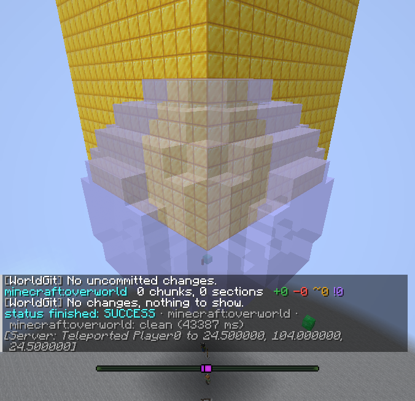

# Axiom 真客戶端證據

日期：2026-10-08。使用 Fabric 1.21.11 dedicated、WorldGit 開發客戶端與正式 Axiom 6.1.3，在 Xvfb 執行 Fabric Client GameTest。

這是未修改的真客戶端畫面。測試透過 Axiom 公開 key binding 開啟編輯器，確認 `EditorUI.isEnabled()` 為 true；畫面中的半透明球形筆刷由 Axiom 繪製。聊天顯示真客戶端的 WorldGit `status --show` 已成功完成，套用後沒有未提交差異。此畫面驗證兩者共同啟動、連線與顯示；各種寫入及拒絕的斷言另由協定 bot 驗證，不以截圖宣稱所有 GUI 工具／undo 均已測試。

- 重跑：`python3 paper/tools/axiom.py fabric 1.21.11 --screenshots`（自取 `.work/bench.lock`）。
- 原始證據：`.work/axiom/fabric-1.21.11-1791445407/`，包括 `result.json`、`console.log`、`client.log`、`client-control/`。
- 結果：56/56 通過；Axiom 編輯器已啟用；伺服器與兩位 bot 退出碼均為 0，連接埠已關閉；線上及離線 verify 皆為 COMPLETE、八項差異計數皆為 0。
- PNG SHA-256：`f1a354faef44a4597c0f680583c593b64c4fca7fa5ad9b82d3812fec30e7cd0c`。
- [可攜驗收摘要](results-2026-10-08.json)：兩版 Paper、Fabric dedicated、未裝 AxiomPaper、既有回歸、完整 build、零差異計數及正式產物雜湊；原始事件／日誌路徑保留於索引。

客戶端日誌保留離線 GameTest 的 Realms／profile key 認證錯誤、既有 options 提示及關閉時 X11 cursor 訊息；沒有 Axiom／WorldGit 的 mixin 或 handler 例外。完整研究與驗收見 [docs/17](../../../../docs/17-axiom.md)。Axiom jar 與分析輸出只存於 `.work`，不隨此證據發佈。
